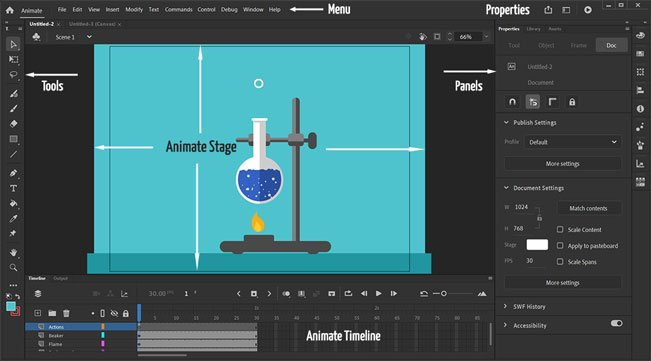

# Làm quen với giao diện

## Phần mềm Adobe Animate 2021

- Phần mềm Adobe Animate là một sản phẩm nổi tiếng của hãng Adobe trên thế giới.
- Bộ công cụ xây dựng hoạt hình hàng đầu cho phép tạo ứng dụng, quảng cáo và nội dung đa phương tiện trên bất kì khung hiển thị nào.

## Không gian làm việc Adobe Animate 2021

Bạn thao tác các tài liệu của mình bằng các phần tử khác nhau, chẳng hạn như bảng, thanh và cửa sổ. Bất kỳ sự sắp xếp nào của các phần tử này được gọi là không gian làm việc. Bạn có thể điều sử dụng một số không gian làm việc mặc định hoặc tự định nghĩa cho riêng mình. Bố cục không gian làm việc khác nhau nhưng trên cơ bản có những thành phần sau:

## Ứng dụng nổi bật chi tiết

### Xây dựng game đồ họa
Bộ công cụ hoạt họa hàng đầu trong ngành của Adobe Animate cho phép bạn tạo ứng dụng, quảng cáo. Và nội dung đa phương tiện hấp dẫn, tương thích mọi màn hình.

Tạo nội dung web tương tác cho game. Và quảng cáo bằng các công cụ minh họa & hiệu ứng chuyên nghiệp. Xây dựng môi trường game, thiết kế màn hình, giao diện khởi động, hình sprite trình phát tương tác. Thậm chí cả âm thanh tích hợp. Với Adobe Animate, bạn có thể thực hiện toàn bộ thiết kế công cụ (asset). Và lập trình ngay trong ứng dụng.

### Tạo hình nhân vật sống động hơn
Phác thảo và vẽ nhiều nhân vật ấn tượng hơn bằng các cây cọ (brush) vector nhạy cảm với lực nhấn và xoay. Chúng hoạt động giống như những cây cọ vẽ thực sự. 

Sử dụng Adobe Animate, bạn có thể làm nhân vật chớp mắt, trò chuyện, đi bộ theo từng khung hình đơn giản. Thậm chí tạo banner web tương tác với hành động của người dùng như chuyển động chuột, chạm, click…

### Xuất bản lên bất kỳ nền tảng nào

Tiếp cận đối tượng trên desktop, mobile, TV bằng cách xuất tác phẩm hoạt họa sang nhiều nền tảng. Bao gồm HTML5 Canvas, WebGL, Flash/Adobe AIR, SVG,…

## Một số thao tác cơ bản

### Khởi động Adobe Animate

- Cách 1: Chọn lệnh Start của Windows 10: Start | Programs | Adobe Animate 2021. Hoặc Start | gõ từ khóa “Animate” | rồi nhấn “Enter”.
- Cách 2: DoubleClick (đúp) hoặc Click vào biểu tượng (icon) của phần mềm Adobe Animate nếu như nhìn thấy nó ở bất kỳ chỗ nào. (Trên màn hình Desktop; Trên thanh Task bar;…).
- Cách 3: Các bạn có thể DoubleClick vào tệp .fla của bạn.

### Đóng Stage hoặc đóng chương trình
- Nhấn Alt + F4 hoặc nhấn Ctrl + Q đóng chương trình.
- Chọn File | Chọn Exit đóng chương trình.
- Chọn File | Chọn Close đóng Stage.
- Chọn File | Chọn Close All đóng tất cả Stage.

### Tạo và xuất tài kiệu HTML
- Chọn File | New | Advanced | Setting các thông số | Nhấn Create.
- Lưu file gốc:  Chọn Flie | Save As | File name (.fla). Bạn test sản phẩm, nhấn tổ hợp phím Ctrl + Enter sẽ xuất ra file .swf, html và js.
- Xuất file: File | Publish Settings | Chọn định dạng file | Publish | OK.

### Phím tắt cần nhớ
- Một số phím tắt gần như tương tự phần mềm Photoshop.
- Vẽ hình tròn, hình vuông, di chuyển thẳng hàng giữ phím Shift.
- Vẽ hình tròn, hình vuông từ tâm giữ tổ hợp phím Alt + Shift.
- Biến đổi đối tượng to nhỏ giữ phím Q (Free Transform).
- Hiệu chỉnh chuyển sắc giữ phím F.
- Phóng to vùng làm việc giữ tổ hợp phím Ctrl + “+”.
- Thu nhỏ  vùng làm việc giữ tổ hợp phím Ctrl + “-”.
- Di chuyển vùng làm việc giữ phím Space.
- Ẩn hiện thước giữ tổ hợp phím Ctrl + Shift + Atl + R.

### Thao tác với đối tượng (Objects)
- Nếu đối tượng có màu trùng (không viền) >> đối tượng được hàn lại với nhau.
- Nếu đối tượng có màu khác nhau >> đối tượng nằm trên cắt đối tượng nằm dưới.
- Modify | Group (Ctrl + G): Nhóm các đối tượng.
- Modify | Break Apart (Ctrl + B): Chuyển Text thành đối tượng Shape.
- Chọn đối tượng giữ Alt rê chuột sang vị trí mới: Copy đối tượng.
- Ctrl + Shift + V: Dán trùng vị trí.

