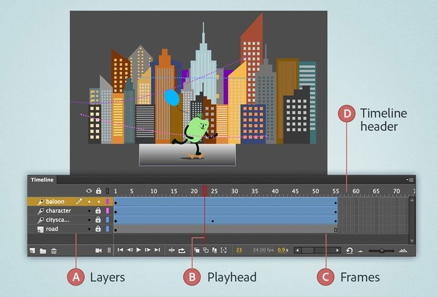
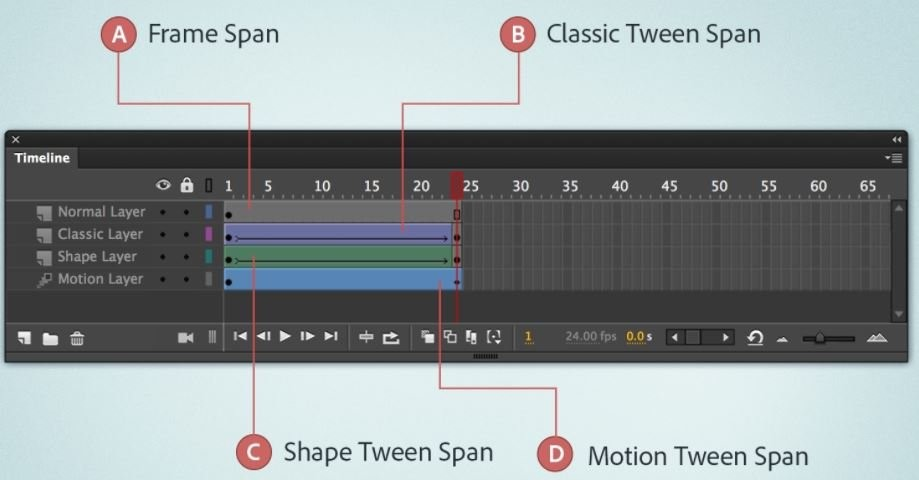
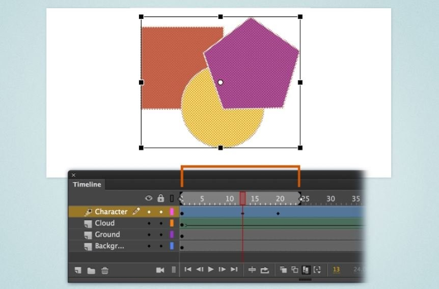
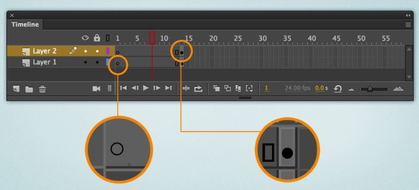
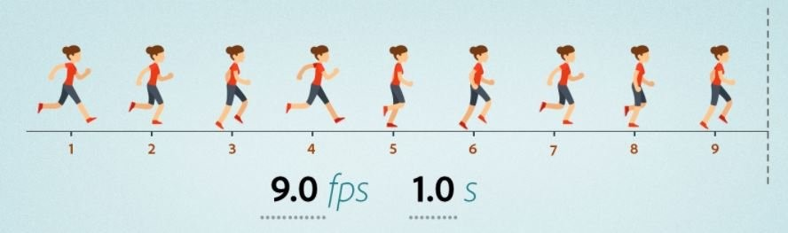
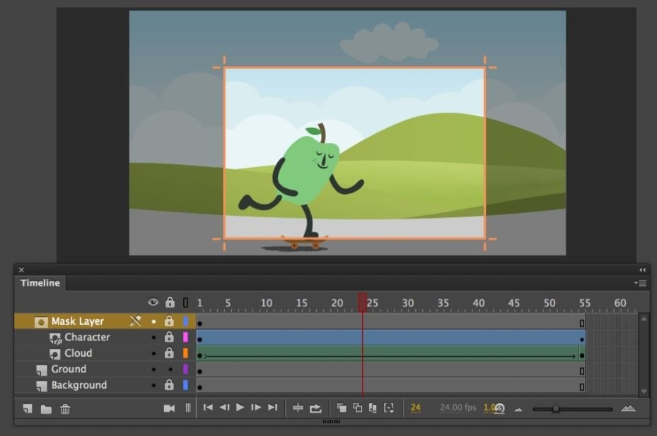

# Làm việc với Timeline

##  Tìm hiểu về Timeline? 
- Là nơi lưu trữ mọi chuyển động trong Animate với phương ngang được xem như là một trục thời gian.
- Là nơi lưu trữ thời gian tồn tại của mỗi đối tượng đơn vị tính bằng frame.

- Các layers trong document được liệt kê trong một cột ở bên trái của timeline.
- Các frames chứa trong mỗi layer xuất hiện thành một hàng ở bên phải tên layer.
- Tiêu đề ở đầu timline cho biết số frame.
- Playhead cho biết frame hiện tại được hiển thị trên stage. Khi một document phát, playhead sẽ di chuyển từ trái sang phải qua timline.

## Frames

- Frame là cốt lõi của bất kỳ diễn hoạt nào, quyết định từng phân đoạn thời gian và chuyển động. Tổng số frame trong phim/tốc độ chúng được phát xác định thời lượng của phim.
- Nhấn F5 tạo thời gian tồn tại. (Hoặc RightClick | Insert Frame).
- Xóa Frame Shift + F5 (Hoặc RightClick | Remove Frames).

## Frame Span

Một keyframe và các frame span (khung hình) theo sau nó được gọi là chuỗi keyframe. Timeline có thể chứa bất kỳ số lượng chuỗi keyframe. Nếu keyframe trong một chuỗi chứa nội dung trên stage, thì các frame span sau nó sẽ có màu xám. Nếu keyframe trong một chuỗi không chứa nội dung, các frame span theo sau nó sẽ có màu trắng.

Animate di chuyển các đối tượng với cùng tốc độ trên mỗi khung hình của chuyển động. Bạn có thể điều chỉnh tốc độ của các đối tượng để làm cho các chuyển động trông tự nhiên hơn. Ví dụ: Bạn tạo chuyển động cho một chiếc ô tô. Ô tô chuyển động sẽ thực tế hơn nếu ô tô bắt đầu nhanh dần từ vị trí xuất phát và chậm dần khi dừng lại.

## Multiframe editing (Chỉnh sửa nhiều khung hình)

Keyframes
 
 

- Keyframe là nơi chứa đối tượng. Thay đổi đối tượng tại keyframe này thì đối tượng tại keyframe khác không thay đổi.
- Nhấn F6 thêm keyframe (Hoặc RightClick | Insert Keyframe).
- Xóa keyframe: Shift + F6 (Chọn Keyframe RightClick chọn Clear Keyframe).
- Nhấn F7 chèn KeyFrame rỗng (Keyframe không chứa đối tượng).
- Xóa keyframe rỗng: Shift + F5.
- Di chuyển Keyframe: Click chọn Keyframe và drag chuột di chuyển.
- Copy Keyframe: RightClick Keyframe | Chọn Copy frame.
- Paste Keyframe: Chọn vị trí cần paste | RightClick | Chọn Paste frame. (Hoặc Chọn Keyframe cần copy giữ Alt và kéo Keyframe đến vị trí cần paste).

## Frames Per Second (FPS)
Tốc độ khung hình được đo bằng số khung hình trên giây. Tốc độ 24 khung hình/giây là cài đặt mặc định và cho kết quả tốt nhất trên web. 

## Layer và Layer mask

- Thao tác tương tự với layer trên các phần mềm khác của Adobe.
- Lớp mặt nạ chứa các đối tượng để che các phần của lớp bên dưới. Và chỉ phần của lớp mặt nạ mới có thể nhìn thấy được.

## Easing
Animate di chuyển các đối tượng với cùng tốc độ trên mỗi khung hình của chuyển động. Bạn có thể điều chỉnh tốc độ của các đối tượng để làm cho các chuyển động trông tự nhiên hơn. Ví dụ: Bạn tạo chuyển động cho một chiếc ô tô. Ô tô chuyển động sẽ thực tế hơn nếu ô tô bắt đầu nhanh dần từ vị trí xuất phát và chậm dần khi dừng lại. 
