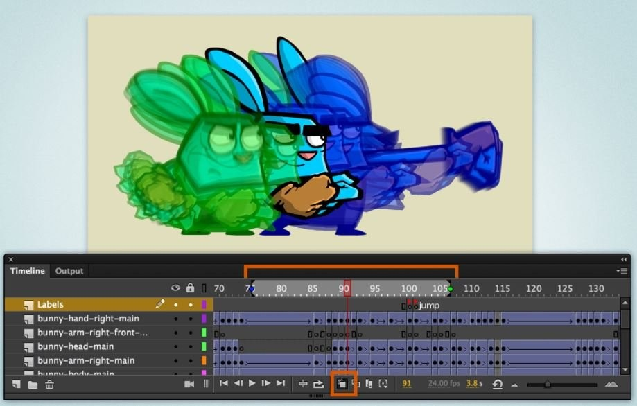

# Diễn hoạt (Animation)

- Có thể chia làm 02 diễn hoạt cơ bản như sau:
  - Frame by Frame: 1-2-3-4-5-6
  - Tweening           : 1 =====> 6 (Xem ở bài viết sau)
- Frame by Frame: Là phương thức cơ bản nhất trong mọi chuyển động. Quá trình của chuyển động được tạo nên bởi sự khác biệt về tính chất trạng thái của các đối tượng tại mỗi khung hình được sắp xếp theo một trình tự.
- Nghịch đảo một đoạn chuyển động: Chọn hết đoạn chuyển động | RightClick vào vùng frame vừa chọn | chọn Reverse frame.
- Biến đổi một khối chuyển động (*di chuyển*):
- Chọn tùy chọn Onion Skin.
- Quét chọn khối chuyển động.
- Bật tùy Edit Multiple frame.
- Edit | Select All (Ctrl + A).
- Di chuyển khối đến vị trí mới.

