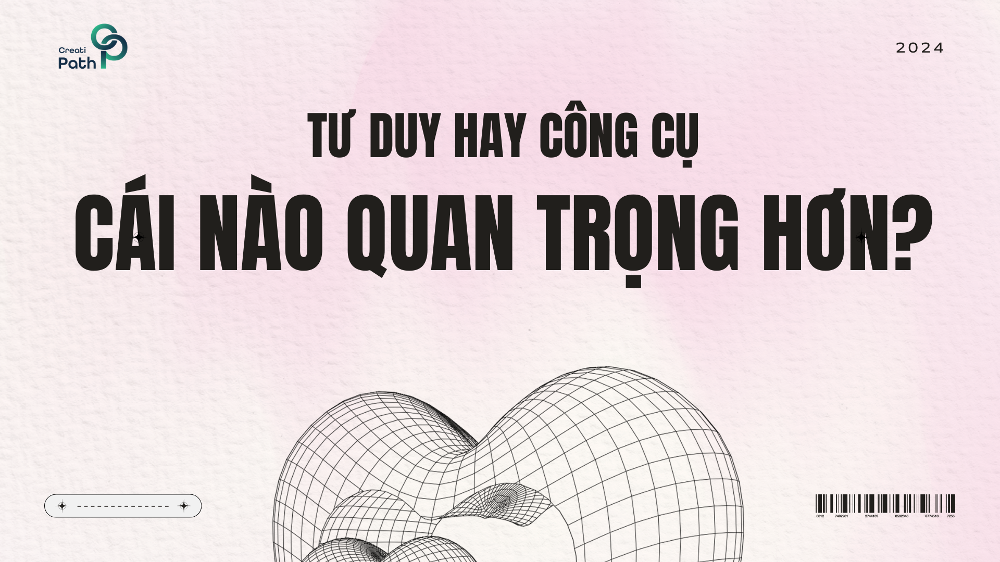
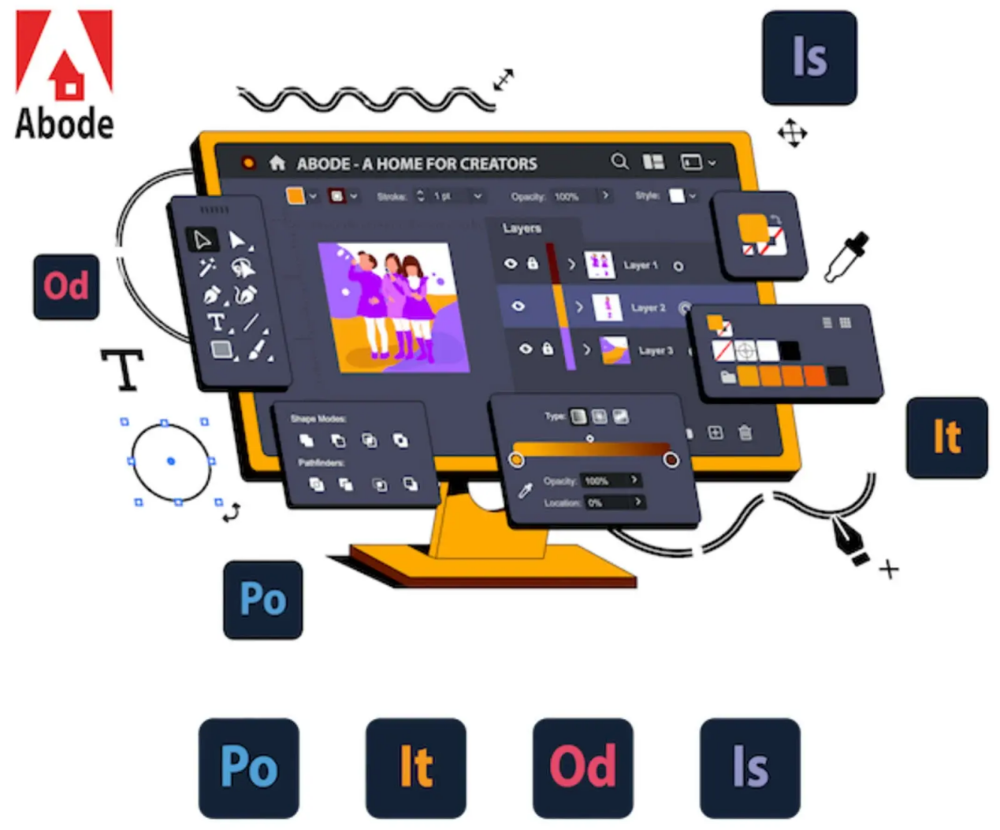

Cả tư duy thiết kế và công cụ đều quan trọng trong quá trình thiết kế.
Tư duy thiết kế là quá trình nghiên cứu người dùng, và xác định lại vấn đề nhằm tìm kiếm các chiến lược và giải pháp thay thế tối ưu hơn. Nó giúp doanh nghiệp thấu hiểu người dùng và mục tiêu. Tư duy thiết kế  cung cấp một loại các giải pháp hữu ích giúp bạn áp dụng vào vấn đề của mình.
 
 

Công cụ thiết kế là những phần mềm hoặc ứng dụng giúp bạn thực hiện ý tưởng của mình thành hiện thực. Công cụ thiết kế giúp bạn tạo ra sản phẩm một cách hiệu quả và chuyên nghiệp.
 
 
 

Tuy nhiên, một thiết kế tốt không chỉ đòi hỏi công cụ mạnh mẽ, mà còn cần sự sáng tạo và tư duy thiết kế. Công cụ có thể hỗ trợ bạn thực hiện ý tưởng, nhưng tư duy thiết kế giúp bạn xác định ý tưởng đó. Vì vậy, cả hai đều quan trọng và bổ sung cho nhau trong quá trình thiết kế.
