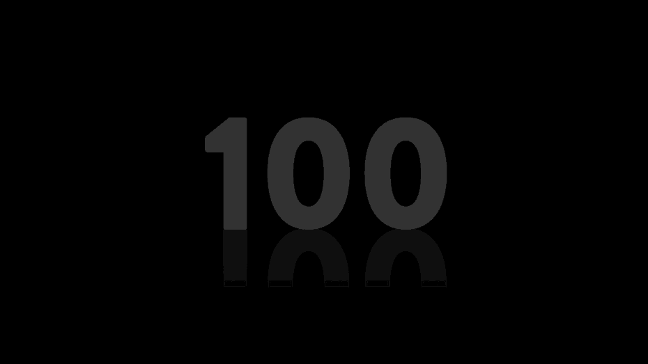
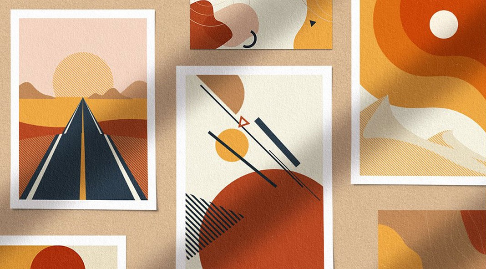
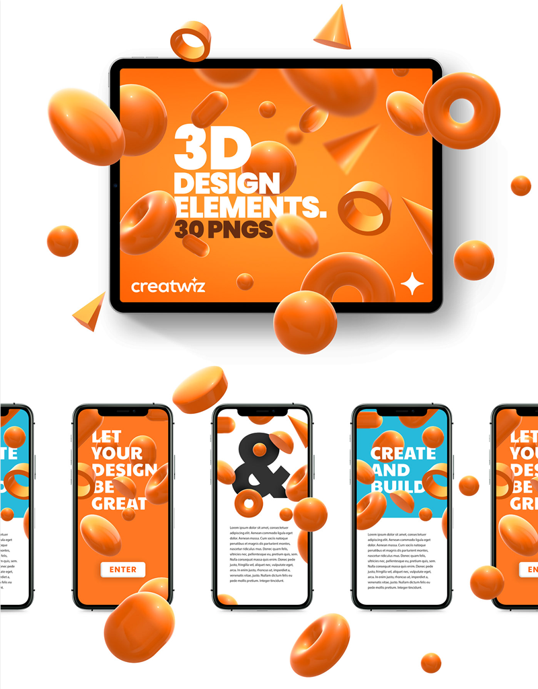
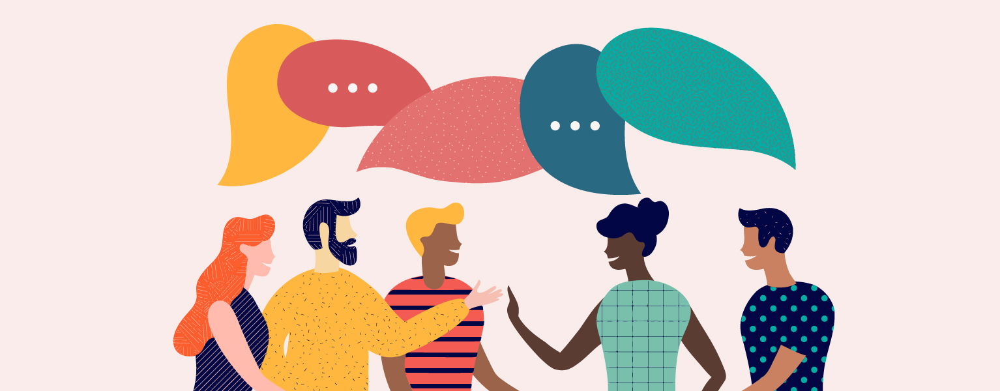
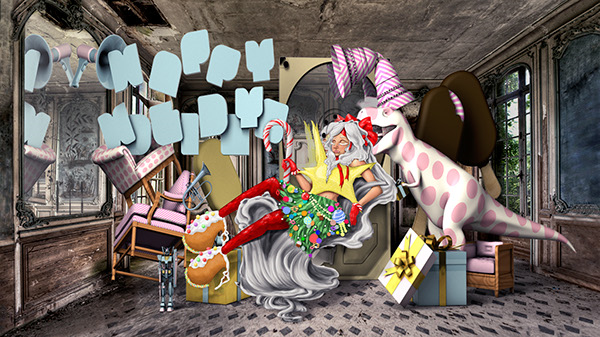
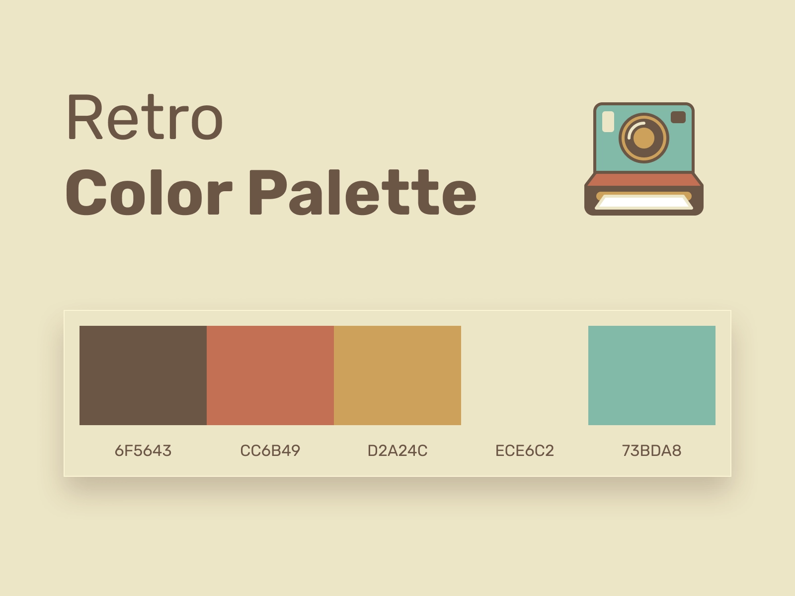
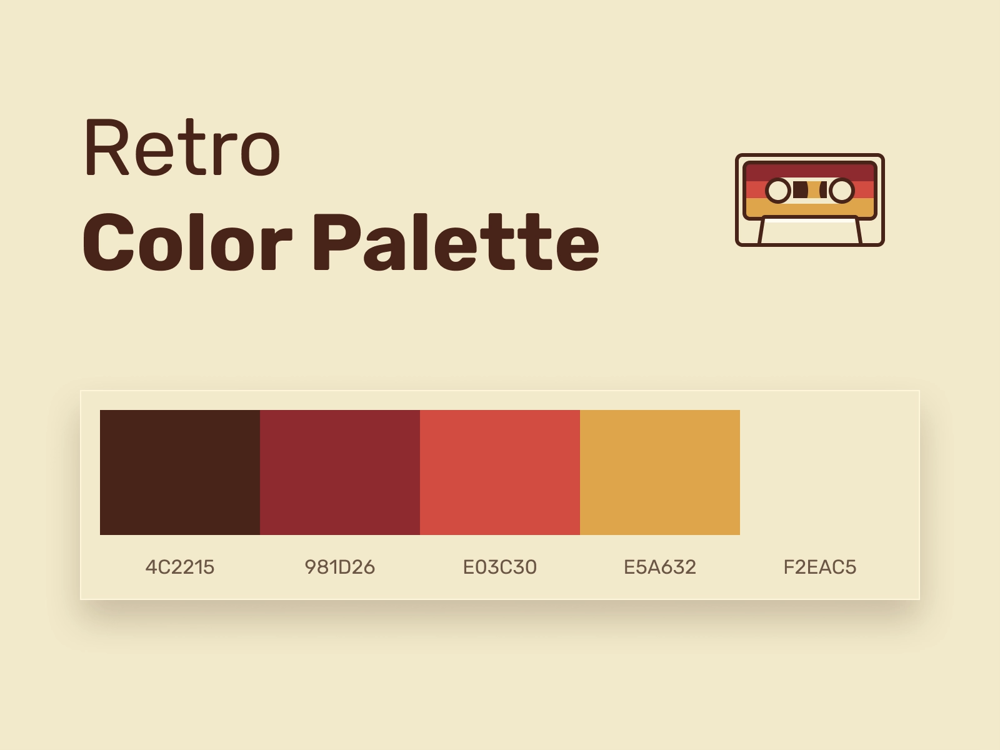
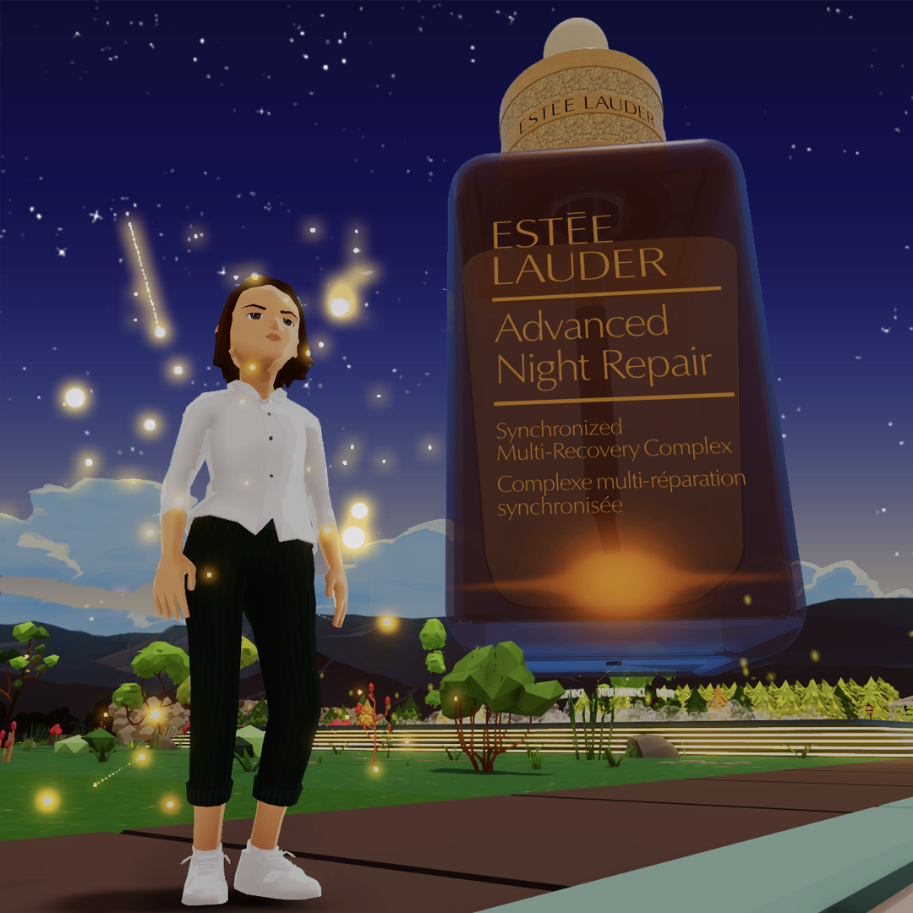

Trong thời gian vừa qua, công việc của một nhà thiết kế đồ họa (Graphic Designer) đã có nhiều thay đổi khi công nghệ ngày càng phát triển. Không chỉ là những hình ảnh tĩnh đơn thuần, giờ đây các thiết kế phải áp dụng nhiều kỹ xảo, tính năng mới lạ như chuyển động (motion), thực tế ảo, thực tế tăng cường, 3D,... để có thể nổi bật trên thị trường, gây ấn tượng và thu hút đối tượng mục tiêu.

Cùng điểm qua những xu hướng thiết kế sẽ nở rộ từ những dự đoán của chuyên gia!

## 1. Motion Graphic (Đồ họa chuyển động)

Motion Graphic là thuật ngữ được kết hợp bởi hai khái niệm là "motion" (chuyển động) và "graphic" (đồ họa). Vì thế, có thể hiểu đơn giản Motion Graphic là đồ họa có khả năng chuyển động. 

Thông thường, các sản phẩm đồ họa chuyển động là những footage hoặc hoạt hình kỹ thuật số tạo cho người xem cảm giác chúng đang chuyển động, luân chuyển hoặc xoay vòng. Những hình khối đồ họa như khối tròn, phông chữ,... khi được ứng dụng Motion Graphic sẽ trở nên sống động và thu hút sự chú ý của người dùng hơn. Xu hướng thiết kế này thường được kết hợp với âm thanh để sử dụng trong các dự án đa phương tiện (multimedia).

 

Hiện nay, người dùng có thể sử dụng các phần mềm như Adobe After Effects, Discreet Combustion, Apple Motion,... để tạo ra những đồ họa chuyển động ấn tượng.

## 2. Bold Abstract Shapes (Hình khối trừu tượng)

Nhằm làm nổi bật hình ảnh sản phẩm hay thông điệp trên mạng xã hội, một số thương hiệu đã sử dụng các hình khối trừu tượng độc đáo. Hình khối trừu tượng sẽ mô phỏng các hình khối tự nhiên như hình tròn, đám mây, chiếc lá,... với các nét đặc tả để cách điệu hoặc đơn giản hóa hình khối ấy. Đơn cử như người que là hình khối trừu tượng được dùng để miêu tả con người, typographic là hình khối mô phỏng chữ viết,...

Có thể thấy, hình khối trừu tượng rất đa dạng về mặt hình thái. Chúng giúp người dùng truyền đạt ý tưởng, cảm xúc bằng những hình dạng tổng quát nhưng đầy sắc sảo, vui tươi và độc đáo. Người dùng có thể thêm chiều sâu và tính cách của bản thân hoặc thương hiệu khi kết hợp màu sắc, độ chuyển màu (gradient), pattern (hoa văn), texture (cấu trúc bề mặt),...

 
 

Một ví dụ về hình khối trừu tượng

## 3. AI-Generated Art (Tác phẩm được tạo ra bởi công nghệ trí tuệ nhân tạo)

Vài năm trở lại đây, trí tuệ nhân tạo (Artificial Intelligence - A.I) đã hóa thân thành một "trợ thủ" đắc lực cho nhiều marketer trong việc sáng tạo nội dung hay thiết kế hình ảnh. Nhiều công cụ thiết kế có sự hỗ trợ từ A.I như DALL-E 2, Midjourney, Stable Diffusion đã "làm mưa làm gió" trong giới sáng tạo với những tác phẩm đầy ấn tượng. 

Không những thế, những tập đoàn/công ty cũng bắt tay vào phát triển những phần mềm có ứng dụng A.I để phục vụ người dùng. Đơn cử như vào tháng 10/2022, Microsoft đã hợp tác với DALL-E 2 ra mắt tính năng "Image Creator" trên nền tảng Microsoft Designer cho phép người dùng sáng tạo hình ảnh bằng văn bản, hay Adobe tung bản cập nhật Photoshop với nhiều công cụ tích hợp A.I,... 

Trong năm 2023, những phiên bản tiếp theo của phần mềm OpenAI, GPT-4 có thể sẽ tiếp tục mang đến nhiều sự đột phá trong thiết kế cho người dùng.

## 4. 3D Elements (Yếu tố thiết kế 3D)

Element là những các yếu tố hỗ trợ người dùng trong thiết kế hình ảnh. Element có thể ở dưới dạng văn bản, hình ảnh, hình dạng,... Thời gian gần đây, các nhà thiết kế có xu hướng sử dụng các element 3D nhằm mang đến chiều sâu và sự trực quan cho các tác phẩm, giúp chúng trở nên chân thực và thu hút hơn.

 
 

Bên cạnh đó, sự phát triển của công nghệ cũng góp phần giúp việc tạo ra các ký tự và yếu tố 3D trở nên dễ dàng hơn.

## 5. Inclusive Visual (Thiết kế toàn diện)

Trong thế giới quảng cáo hiện nay, tính toàn diện (inclusivity) đang được đề cao hơn bao giờ hết. Các thương hiệu có xu hướng thực hiện các chiến dịch tiếp cận đến người dùng ở đa dạng sắc tộc và giới tính. Điều này không chỉ giúp mở rộng tệp khách hàng mục tiêu mà còn góp phần thể hiện tính chân thực, khả năng tiếp cận và hình ảnh thương hiệu trong mắt người dùng.

 
 

## 6. Surrealist Maximalism (Chủ nghĩa tối đa siêu thực)

Sau sự ảnh hưởng của đại dịch, những thiết kế tối giản (minimalism) đang dần “nhường ngôi” cho các thiết kế mang phong cách tối đa (maximalism). Chủ nghĩa tối đa là một thuật ngữ được sử dụng trong nghệ thuật thị giác và thiết kế từ cuối những năm 1970. Các thiết kế theo chủ nghĩa tối đa thường gây ấn tượng mạnh với sự "bùng nổ" của những sắc màu tươi sáng và họa tiết trang trí. Trong khi đó, trường phái siêu thực (surrealism) là khuynh hướng nghệ thuật với những hình minh họa dị thường/phi logic, màu sắc rực rỡ, nhiều yếu tố gây choáng ngợp,...

 
 

Hình minh họa cho phong cách Surrealist Maximalism

Nhiều ý kiến các tác phẩm mang phong cách này thường có yếu tố "dư thừa" nhưng trên thực tế, chúng có sự độc đáo về tính trang trí và truyền cảm hứng sáng tạo cho người dùng. Các tác phẩm nghệ thuật mang phong cách Surrealist Maximalism thường thể hiện rõ ràng cá tính của tác giả.

## 7. Colorful Retro Illustration (Hình minh họa theo phong cách Retro đầy màu sắc)

Sự hồi sinh của thập niên 90 sẽ khiến xu hướng thiết kế hình ảnh cổ điển nở rộ trong năm 2023. Khi kết hợp cùng tông màu retro (những màu có độ bão hòa thấp, kém tươi tắn), các hình minh họa sẽ tạo cảm giác xưa cũ, cổ điển của quá khứ nhưng cũng không kém phần hiện đại.

 
 

 
 

Một số tông màu retro (Nguồn: Dribbble)

## 8. Virtual Reality (Thực tế ảo)

Trong vòng hai năm trở lại đây, công chúng đã bất ngờ trước sự xuất hiện và phát triển mạnh mẽ của hàng loạt công nghệ mới như metaverse và sự nở rộ của NFT (2012). Thế giới ảo này đã phần nào thay đổi cách các thương hiệu xây dựng các chiến lược tiếp thị, biến hóa nội dung và hình ảnh theo những phương thức mới mẻ và... gây sửng sốt cho người dùng. 

Không chỉ mang đến các sản phẩm chăm sóc làn da con người ở đời thực, Estée Lauder còn quảng cáo Night Repair Serum trong cả thế giới ảo vào tuần lễ thời trang metaverse. Thương hiệu đã thiết kế một filter dành riêng cho loại serum mới. Khi người dùng chọn sử dụng nó, nhân vật trong thế giới ảo sẽ có vẻ ngoài rạng rỡ và lấp lánh hơn. Hay như cách Nike đã tạo ra tựa game hóa thân Nikeland. Tại đây, người dùng có thể thỏa thích xây dựng một nhân vật ảo với những thiết kế hiện đại đầy màu sắc. Thương hiệu này đã biến hóa những mẫu giày dép, quần áo,... mà họ kinh doanh ở đời thực thành các item trong thế giới ảo để mang sản phẩm đến gần với người dùng hơn. 

 
 

Sau khi sử dụng sản phẩm của Estée Lauder trong metaverse, làn da của nhân vật sẽ trở nên lấp lánh

Dự đoán trong năm 2023, những trải nghiệm UX nhập vai, kiểu chữ mang phong cách khoa học viễn tưởng và màu sắc đậm tính chất tương lai sẽ trở thành một trong những xu hướng thiết kế nổi bật.

