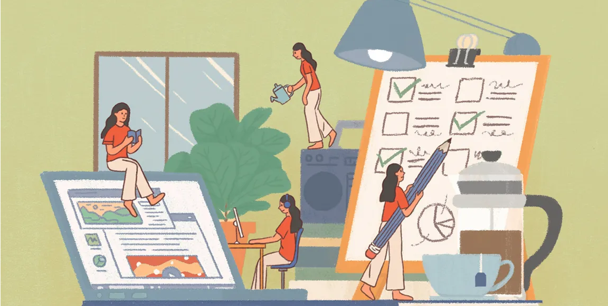
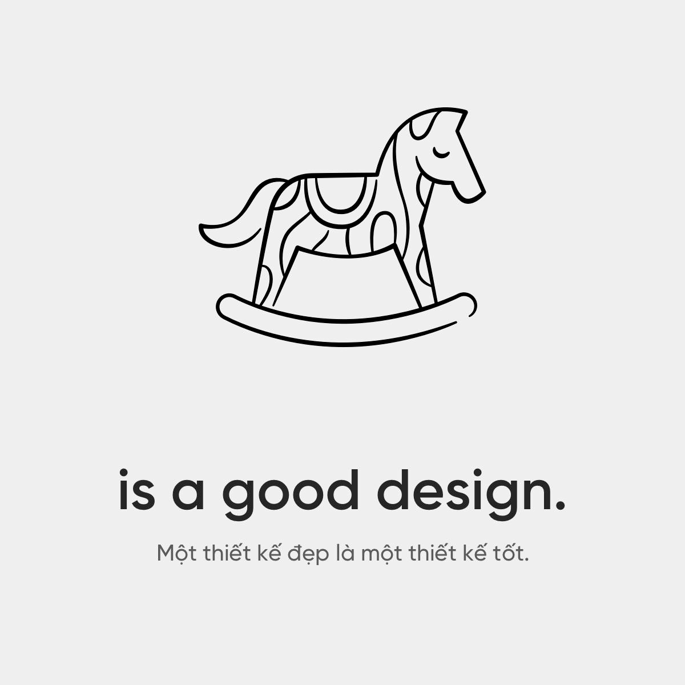
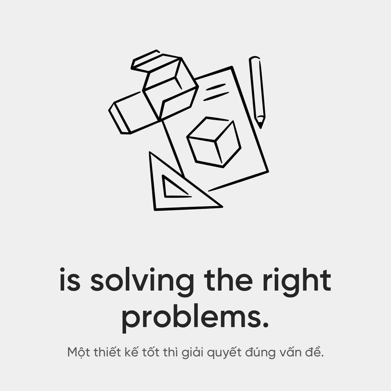
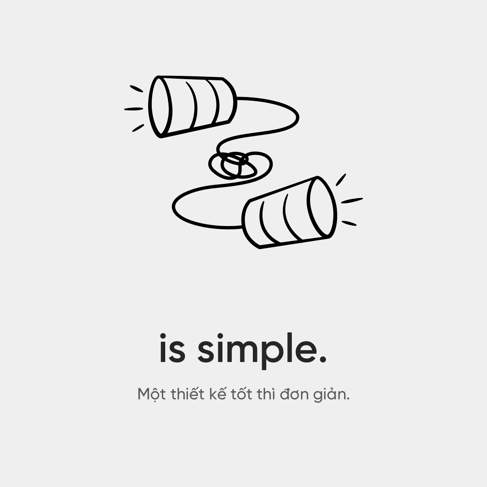
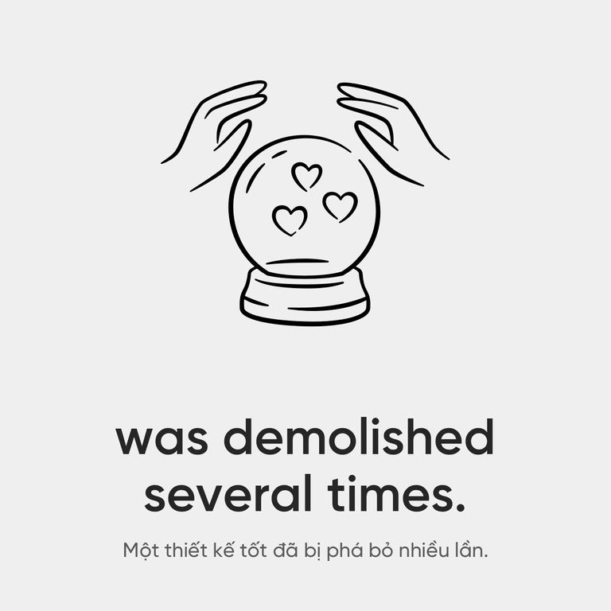
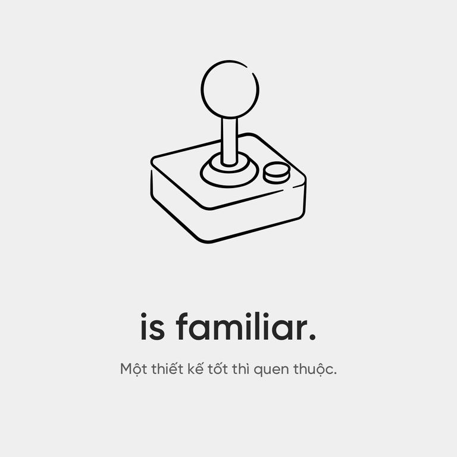
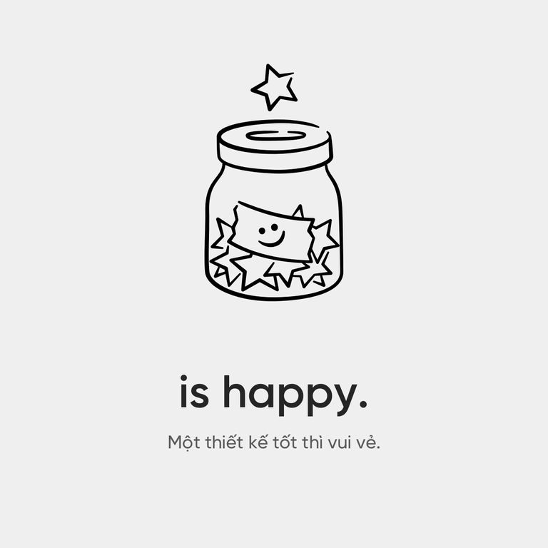

:::info <b>Từ điển Oxford định nghĩa:</b>
Cái đẹp là sự kết hợp của những phẩm chất như hình dạng, màu sắc hoặc hình thức, làm thỏa mãn các giác quan thẩm mỹ, đặc biệt là thị giác."
:::

:::info <b>Nhà triết học Immanuel Kant từng nói:</b>
Vẻ đẹp không nằm ở đôi má hồng của người thiếu nữ mà ở trong đôi mắt của kẻ si tình.
:::

Khi bàn luận về sự xấu đẹp, chúng ta luôn thừa nhận nó phụ thuộc chủ quan vào người đưa ra đánh giá. Và vì thế giới quan của mỗi người khác nhau, nên ta cho rằng cái đẹp thật khó nắm bắt. Nếu là thế thật thì ngành thiết kế coi như vô vọng.
Nhưng sự thật là có những thứ được nhiều người công nhận đẹp. Điện thoại iPhone gần như có thể làm hài lòng người ta ở bất cứ độ tuổi, hay thành phần xã hội nào.
Vậy, cái đẹp là có thật và người thiết kế cần phải học cách nhận ra nó. Và thay vì theo đuổi 1 thứ khó nắm bắt như cái đẹp, hãy đổi câu hỏi "Làm thế nào để thiết kế này đẹp hơn?" thành:
"Làm thế nào để thiết kế này tốt hơn?"

## 1. Một thiết kế đẹp, trước hết phải là một thiết kế tốt
 
 

Nếu bạn đặt thước đo cho 1 thiết kế là đẹp, thì nghĩa là nếu nó đẹp hơn - nó sẽ tốt hơn.
Suy cho cùng, dù làm bất cứ công việc gì, xu hướng tự nhiên của chúng ta là luôn muốn làm nó tốt hơn
Quay trở lại việc đẹp - xấu, thay vì thuyết phục người khác rằng đây là thiết kế đẹp nhất, hãy nói với họ rằng thiết kế này là giải pháp phù hợp nhất.
Khi "phù hợp nhất" là tốt nhất thì những điều ta có thể làm để 1 thiết kế tốt hơn là...
Quay trở lại việc đẹp - xấu, thay vì thuyết phục người khác rằng đây là thiết kế đẹp nhất, hãy nói với họ rằng thiết kế này là giải pháp phù hợp nhất.
Khi "phù hợp nhất" là tốt nhất thì những điều ta có thể làm để 1 thiết kế tốt hơn là...

## 2. Một thiết kế tốt, thì giải quyết đúng vấn đề
 
 

Trong bài phát biểu "The three ways that good design makes you happy", Don Norman đã nhắc tới ví dụ:
Một chiếc máy ép trái cây được thiết kế mạ vàng rất đẹp, nhưng ông chỉ có thể để nó làm vật trang trí thay vì làm đúng công năng ban đầu - lý do là acid trong trái cây sẽ làm bay lớp vỏ mạ vàng.
Điều tạo ra sự khác biệt giữa tác phẩm nghệ thuật với sản phẩm thiết kế đó là vấn đề mà nó giải quyết.
Trong khi tác phẩm nghệ thuật giải quyết vấn đề của người làm ra nó (vì cái tôi, vì thích,...).
Thì sản phẩm thiết kế tập trung giải quyết của người sẽ sử dụng nó.
Tìm được đúng vấn đề, thì bạn đã giải quyết được 70% công việc cần làm.

## 3. Một thiết kế tốt, thì đơn giản 
 

Điều này đúng gần như với mọi ngành, giải đúng với 1 bài toán với ít bước nhất thì hay nhất, viết 1 bài blog ngắn gọn xúc tích thì khó nhất.
Khi mới bắt đầu, những thiết kế của mình thường rất rườm rà, nhét đầy vào đó những họa tiết rối rắm, màu mè để chứng minh là mình có một chất riêng nào đó. Bây giờ nhìn lại tất cả những thứ đó, nó chẳng để giải quyết bất cứ vấn đề nào cả.
Chúng thật vô nghĩa!
Sự khó khăn khi theo đuổi “thiết kế đơn giản” đó là rất tốn công, những người thiết kế theo phong cách tối giản thường chia 2 hướng:
Một là vì lười, thường họ sẽ tìm cách sao chép văn bản và sản phẩm của người khác.
Hai là cực kỳ chăm chỉ, họ lao động thực sự nghiêm túc trong công việc. Càng muốn có phương pháp đơn giản, nhiệm vụ giải quyết vấn đề càng trở nên phức tạp.
Thiết kế đơn giản cũng khiến cho sản phẩm cuối cùng trông có vẻ dễ ăn, hay ít dụng công. Chắc hẳn không ít lần các bạn gặp trường hợp “Cái này thì chị cũng làm được!"

## 4. Một thiết kế tốt, đã bị phá bỏ nhiều lần
 

Làm đúng một thứ ngay từ đầu? Có thể gọi đó là sự may mắn, nhưng những người chuyên nghiệp thì không tin may mắn có thể lặp lại nhiều lần. Họ biết rằng những giải pháp ban đầu thường ít khi hiệu quả ngay lập tức.
Thông thường, chúng ta sẽ có xu hướng thiên vị những thứ đầu tiên xuất hiện trong đầu, vì thế để bỏ được chúng - designer cần phải rất tự tin.
Sai lầm hay giải pháp không hiệu quả là chuyện đương nhiên, nó là điều cần phải có cho sự tiến bộ. Điều cần làm là đừng mắc lại 1 sai lầm nhiều lần, và có tư duy cởi mở để sớm nhận ra chúng.

## 5. Một thiết kế tốt, thì quen thuộc

 

Con người chúng ta thích sự điển hình và quen thuộc tới nỗi các học giả đặt tên cho điều này là: koinophilia. Bắt nguồn từ tiếng Hy Lạp là "Koinos" - "Thông thường” và "Philos" - "Tình yêu".
Ý chỉ chúng ta có xu hướng yêu chuộng những gì quen thuộc, và chúng ta thấy những điều đó thật đẹp.
Bắt chước thiên nhiên (biomimicry) là cách an toàn nhất. Không phải vì nó đẹp, mà do chọn lọc tự nhiên đã trải qua hàng trăm triệu năm thử và sai để giải quyết các vấn đề. Và vì chúng là những thứ quen thuộc mà ta nhìn thấy hàng ngày.
Chẳng phải nhân loại đã có vô số phát minh học theo tự nhiên như: máy bay ban đầu trông giống như chim, giác hút cao su giống giác hút bạch tuộc,... Là một nhà thiết kế, chúng ta có thể tham khảo các cấu trúc hình học, phối màu, không gian... từ thiên nhiên để đưa vào sản phẩm của mình.

## 6. Một thiết kế tốt, thì vui vẻ
 

Như có nói ở phần 2, thiết kế tốt thì phải giải quyết đúng vấn đề. Và khi những thứ khó chịu được giải quyết, chúng ta sẽ vui vẻ.
Khi một khách hàng vui vẻ với sản phẩm, dịch vụ thì họ sẽ quay trở lại, sẽ giới thiệu bạn bè và sẽ gắn bó lâu dài với chúng ta.
Vì thế, để biết được thiết kế có thật sự tốt hay không, hãy hỏi cảm xúc của những người sử dụng chúng.

