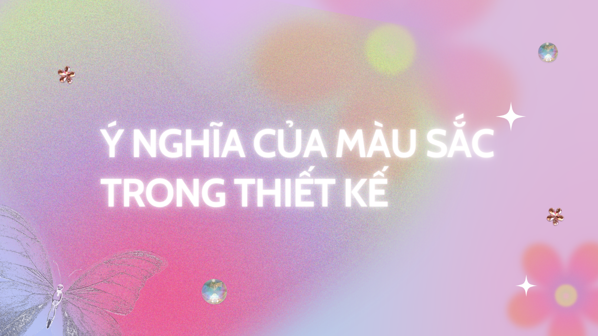

:::info
Màu sắc là linh hồn của thiết kế. Nó là nghệ thuật, và cũng là khoa học. Mỗi màu sắc đều mang những cảm xúc và ý nghĩa riêng, trong bài viết này chúng ta sẽ tìm hiểu ý nghĩa màu sắc phổ biến nhất. Ngoài ra, bài viết cũng sẽ liệu kê một số ví dụ về cách ứng dụng màu sắc trong thiết kế, để bạn có cái nhìn bao quát hơn về cách sử dụng màu sắc. 
:::

## Màu đỏ
Màu đỏ là một trong nhóm ba màu cơ bản. Màu đỏ tượng trưng cho lửa, nhiệt lượng và đam mê. Nó có thể biểu thị cho tình yêu nhưng cũng có thể là sự tức giận. Trong cuộc sống hằng ngày của chúng ta, màu đỏ thường gắn với cảnh báo hay nguy hiểm. Ví dụ, khi đèn giao thông chuyển sang màu đỏ, đó là tín hiệu cho người lái xe dừng lại. Nó cũng là màu phổ biến trên các biển báo dừng trên phố. Trên các thiết bị điện tử, ý nghĩa màu sắc đỏ có thể có nghĩa là tắt (tắt nguồn, tắt cuộc gọi,...) trong khi màu xanh lá có nghĩa là bật (bật âm thanh, bật cuộc gọi,...).
Yếu tố văn hóa cũng có ảnh hưởng đến ý nghĩa màu sắc. Trong văn hóa Trung Quốc, màu đỏ tượng trưng cho sự may mắn, thịnh vượng. Ở một số nền văn hóa Phương Đông, cô dâu sẽ mặc đồ màu đỏ trong đám cưới. Trong khi ở Nam Phi, màu đỏ lại là màu của tang tóc. Ngoài ra, màu đỏ gắn liền với chiến dịch nâng cao nhận thức về AIDS và cũng tương quan với hình ảnh của chủ nghĩa cộng sản.
Trong thiết kế UI, màu đỏ có thể được sử dụng với bộ chọn (selector), nút kêu gọi hành động (CTA) và các nút tắt/bật.
 
 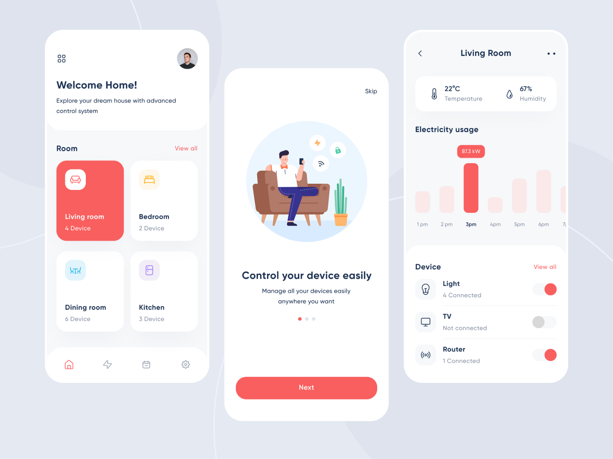
 
## Màu cam
Màu cam truyền tải sự phấn khích và khích lệ. Bởi màu cam là sự pha trộn giữa màu đỏ và vàng, nó mang lại sự ấm áp từ màu đỏ và sự lạc quan của màu vàng. Nó rực rỡ, thường được gắn liền với mặt trời, trái đất và mùa thu. Tương tự như trái cây, cam cũng liên quan tới sức khỏe, sức sống và khả năng miễn dịch. Nó tràn đầy năng lượng và liên kết với tính hướng ngoại.
Tương tự như màu đỏ, màu cam có thể tạo sự thu hút và chú ý trong thiết kế, vì vậy hãy dùng nó một cách có chiến lược. Trong ví dụ dưới đây, màu cam được sử dụng là màu chủ đạo, có đủ sắc độ từ đậm tới nhạt tạo độ sâu cho thiết kế, đồng thời nó được kết hợp với màu xanh-tím tạo tương phản về nóng-lạnh giúp thiết kế trở nên thú vị hơn.
 
 
 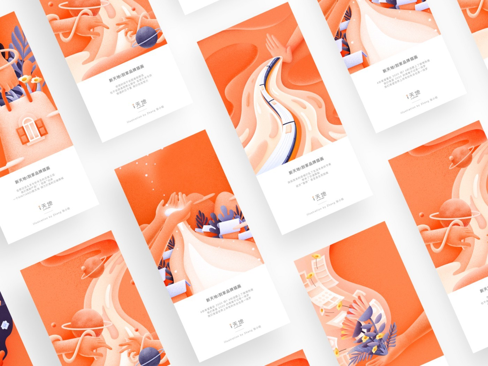
 
## Màu vàng
Màu vàng là một màu tươi sáng, đầy năng lượng. Khơi gợi cảm hứng về mặt trời, màu vàng có ánh năng và hạnh phúc. Trong các ấn phẩm đại chúng, khuôn mặt hạnh phúc luôn có sắc vàng với nụ cười thật tươi.
Màu vàng cũng có ý nghĩa là niềm hy vọng. Ở một số quốc gia, dải ruy băng màu vàng được trưng bày như một cách để tôn vinh các gia đình tham gia chiến trận. Màu sắc vàng cũng có thể là một dấu hiệu của sự hối hận. Nếu bạn gửi cho ai đó những bông hoa màu vàng, nó là một hành động xin lỗi. Màu vàng có thể là một dấu hiệu của sự thận trọng, chẳng hạn như đèn vàng trong đèn giao thông.
Trong thiết kế, màu vàng có thể là một màu khó dùng. Có thể bạn sẽ không muốn dùng nó cho văn bản cần tối ưu việc đọc, nhưng nó có thể là màu nhấn nhá trên tiêu đề, giúp nội dung của bạn nổi bật hơn. Một ví dụ ứng dụng màu vàng với văn bản và minh họa:
 
 
 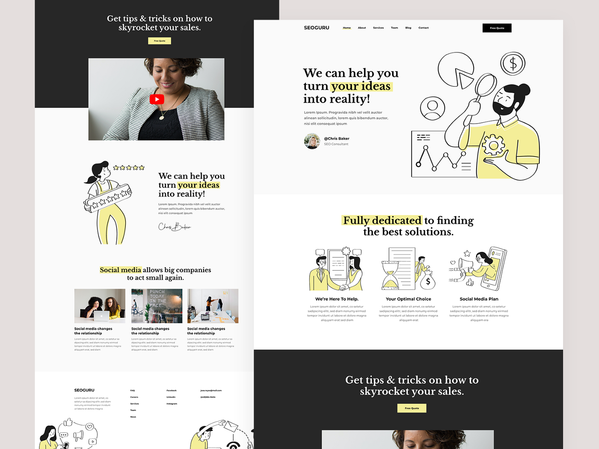

## Màu xanh lá
Với màu xanh lá, thứ mà ngay lập tức chúng ta liên tưởng đó là Trái Đất và các yếu tố tự nhiên. Nó tượng trưng cho sự phát triển, đổi mới, tươi mới, dồi dào, cân bằng, hài hòa và những khởi đầu mới. Nhưng màu xanh lá cũng có một số liên tưởng tiêu cực mà chủ yếu xuất phát từ tiền bạc, cảm giác tội lỗi, tham lam, đố kỵ và ghen ghét.
Trong thiết kế, nó đối lập với màu đỏ. Như đã nói ở trên, màu đỏ có nghĩa là tắt thì màu xanh lá có nghĩa là bật. Xem xét ví dụ dưới đây, màu xanh lá được sử dụng trong thiết kế website, từ CTA đến tiêu đề và cả các minh họa mang thiên nhiên. Nó tuyệt đối phù hợp cho chủ đề trang web - Giải cứu hành tinh của chúng ta. 
 
 
 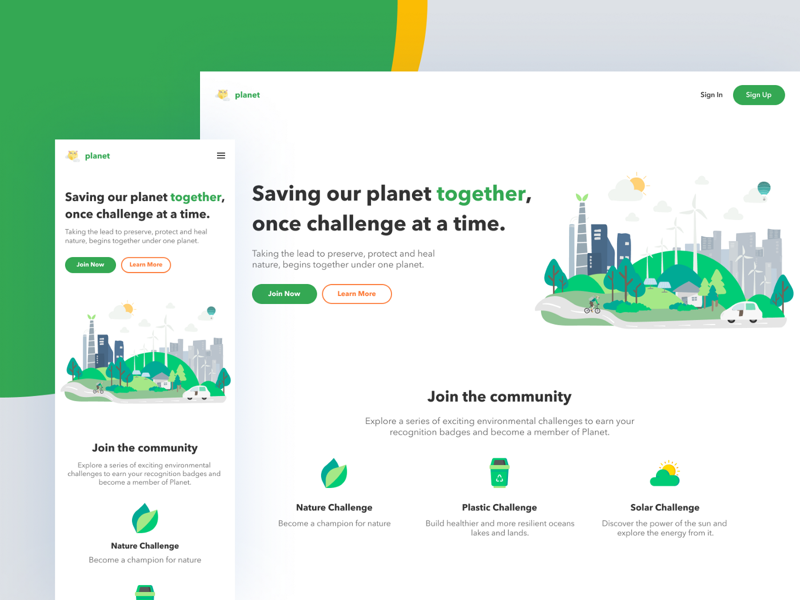

## Màu xanh lam
Màu xanh lam, màu của đại dương và bầu trời, tượng trưng cho sự bình tĩnh, hòa bình, ổn định và trách nhiệm. Nó cũng liên quan tới những yếu tố tâm linh, tôn giáo. Trong ngôn ngữ Tiếng Anh (blue), nó được liên kết với nỗi buồn (feeling blue). Sắc độ ảnh hưởng rất nhiều tới ý nghĩa của xanh lam. Ví dụ nếu màu xanh nhạt (pha nhiều trắng) mang ý nghĩa của sự bình tĩnh, thư giãn nhưng nếu nó là màu xanh đậm (pha nhiều đen) nó sẽ mang ý nghĩa về sự tin tưởng, sức mạnh.
Nói đến thiết kế, màu xanh lam thường gắn liền tới lòng trung thành và sự tin cậy, không lạ gì khi hầu hết các tập đoàn đều dùng màu xanh lam cho thiết kế nhận diện. Dưới đây là một số ví dụ nổi tiếng.
 
 
 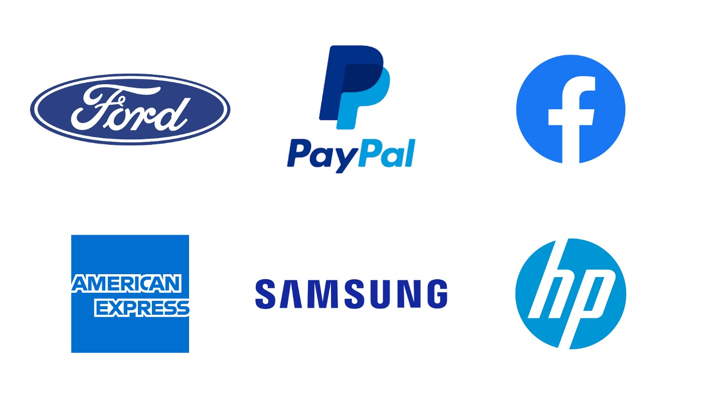

## Màu tím
Thời xa xưa, màu tím là một màu hiếm, nó không dễ để tìm thấy trong tự nhiên, cũng như rất tốn kém để pha chế. Đó là lý do mà màu tím là màu dành cho những người giàu có. Màu tím gợi nhiều cảm xúc hơn hầu hết các màu khác. Nó tượng trưng cho hoàng gia, quý tộc, sang trọng, ma thuật, bí ẩn, sáng tạo và tâm linh.
Ngày nay với khoa học, chúng ta biết màu tím là màu có bước sóng mạnh nhất trên quang phổ điện từ. Hãy để ý ở biểu đồ dưới, nó nằm gần tia X và tia Gamma. Đó có thể là lý do mà màu tím thường liên quan tới năng lượng siêu nhiên.

 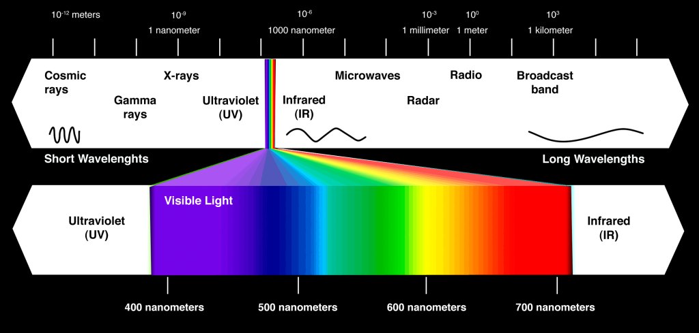
 
Có sự phân cực khi nói tới màu tím, hầu hết mọi người đều, hoặc là yêu hoặc sẽ là ghét nó. Tại Mỹ, Purple Heart (trái tim màu tím) là một giải thưởng cho sự dũng cảm. Ý nghĩa màu sắc tím cũng biểu tượng trong nền văn hóa phương Tây dành cho cộng đồng đồng tính.
Trong thiết kế, nếu bạn muốn màu tím của mình thiên lạnh hãy pha thêm màu xanh lam, ngược lại ấm hơn hãy pha thêm đỏ. Tím là màu khó dùng nhưng cũng bởi vậy nó cũng có thể giúp thương hiệu nổi bật hơn khi đứng với đối thủ.
 
 
 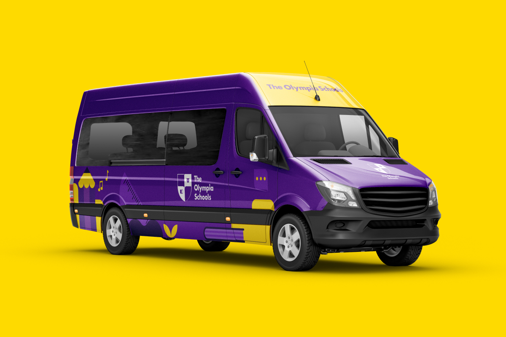
 
## Màu hồng
Màu hồng được coi là tông (tint) thay vì một màu, bởi nó vốn là màu được pha từ màu đỏ và trắng. Trong hầu hết các nền văn hóa, màu hồng đại diện cho nữ tính. Nó được sử dụng để nâng cao nhận thức về bệnh ung thư vú, cũng như là đại diện cho rất nhiều sản phẩm dành cho phái nữ. Với trẻ em, màu hồng thường được gắn với các bé gái, trong khi các bé trai sẽ là màu xanh lam.
Khi nói đến thiết kế, màu hồng có thể thay đổi để tạo thêm sự thú vị cho thiết kế. Ví dụ, có thể pha thêm đỏ để truyền tải hương vị kem dâu tây trong thiết kế web này.
 
 
 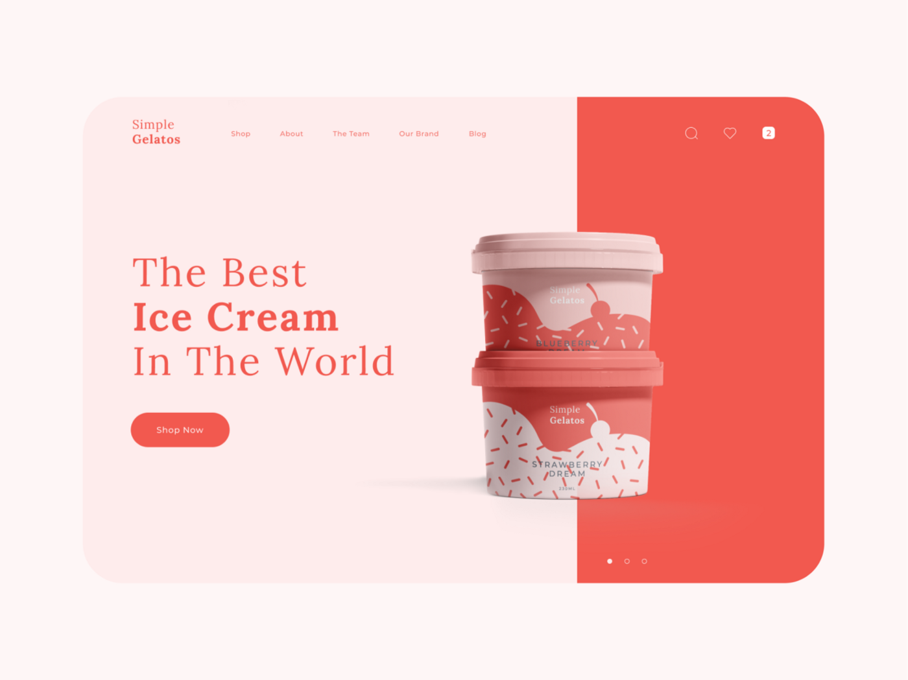
 
## Màu nâu
Màu nâu, màu của đất, gỗ, và là một màu trung tính. Bởi nó mang cảm giác ấm áp và thường được thấy trong tự nhiên, vậy nên nó đại diện cho sự lành mạnh, lành tính và đáng tin.
Với thiết kế, màu nâu như một màu thể hiện tính hữu cơ cho các sản phẩm thực phẩm. Màu nâu không nên dùng trên những mảng màu đặc, lớn, thay vào đó nó nên được cân nhắc và chọn lọc về cả tỷ lệ lẫn sắc độ. Trong trường hợp màu nâu quá khó dùng với bạn, bạn có thể cân nhắc tới màu be hay nâu vàng - những màu biến thể của nâu. Tông màu nâu nhạt sẽ mang cảm giác ấm áp, tông màu nâu đậm sẽ tạo ra cảm giác trầm lắng, cổ điển.
 
 
 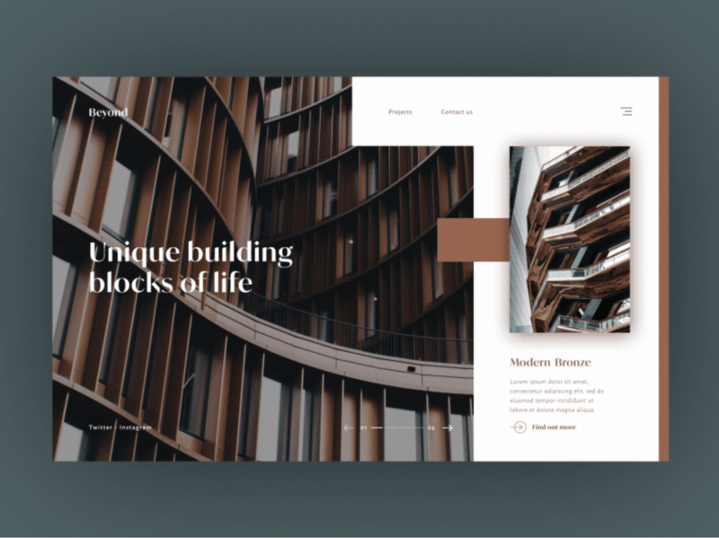
 
### Ý nghĩa màu sắc chỉ là khởi đầu
Như chúng ta có thể thấy, mỗi màu sắc đều có ý nghĩa riêng của nó. Ngoài ra, ý nghĩa ấy cũng phụ thuộc vào sự biến đổi của màu sắc, phụ thuộc vào yếu tố bên ngoài là con người và văn hóa. Và đặc biệt, nó phụ thuộc nhiều nhất ở sự hiểu và kỹ năng của người sử dụng. Với thiết kế, kiến thức về màu là một trong những kiến thức nền tảng và nó vừa khó vừa dễ. Dễ ở việc biết về sự biến hóa của màu sắc, nhưng khó ở việc rèn luyện để có được khả năng biến hóa ấy. Và mọi thứ cần thời gian, không có kỹ năng nào không cần mài dũa. Màu sắc là linh hồn của thiết kế, vậy nên thành quả sẽ xứng đáng với công sức bỏ ra.

:::tip
Màu sắc đóng vai trò rất quan trọng trong các ấn phẩm thiết kế đồ họa. Tuy nhiên, nhiều Designer lại không biết được ý nghĩa màu sắc trong thiết kế cụ thể là gì. Chính điều này khiến cho việc sử dụng màu và phối màu trong quá trình thực hiện gặp nhiều khó khăn. Những ấn phẩm thiết kế có màu sắc ấn tượng sẽ càng gây được thiện cảm với khách hàng. 
:::

## Bánh xe màu căn bản

 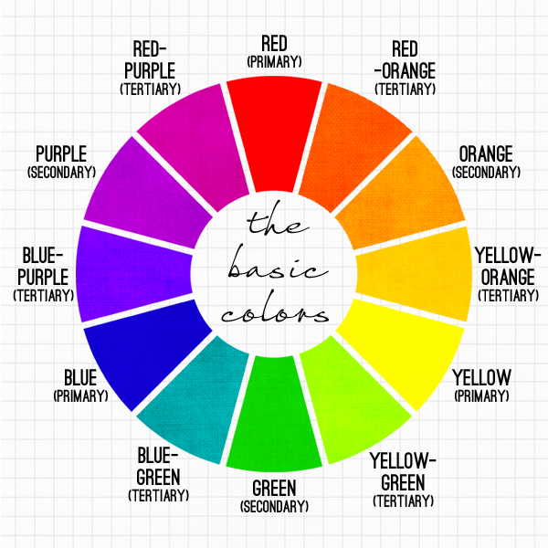
 
Với vòng tròn gồm 12 màu sắc, và mỗi màu sắc đó lại có 8 cấp độ khác nhau. Tổng cộng sẽ có 106 màu sắc cơ bản, đấy chính là những con số màu sắc giúp bạn lựa chọn màu sắc đơn giản hơn.
### Sự hài hòa của màu sắc
Được thể hiện qua sự phối hợp màu sắc nhuần nhuyễn để tạo ra sự khác biệt trong thiết kế.
### Bối cảnh màu sắc đem lại
Mỗi khi nhắc đến bối cảnh, người ta lại nhắc đến phông nền, hình ảnh nền, bố cục màu. Một bối cảnh màu sắc chỉ thật sự đẹp khi nó được kết hợp chúng một cách hoàn hảo nhất mà thôi.
Với những ý nghĩa màu sắc trong thiết kế cụ thể nêu trên, chắc chắn sẽ giúp các nhà thiết kế thuận tiện hơn trong quá trình chọn lựa màu sắc cho ấn phẩm của mình. Việc kết hợp màu sắc phù hợp chắc chắn là yếu tố hàng đầu giúp bạn hoàn thiện tác phẩm của mình.

