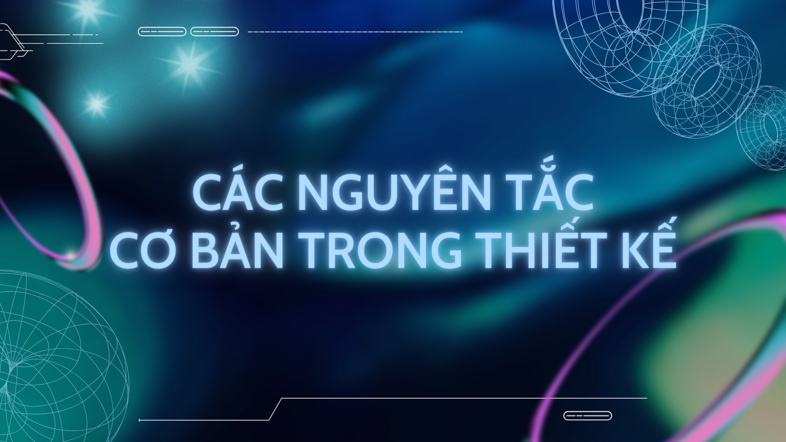
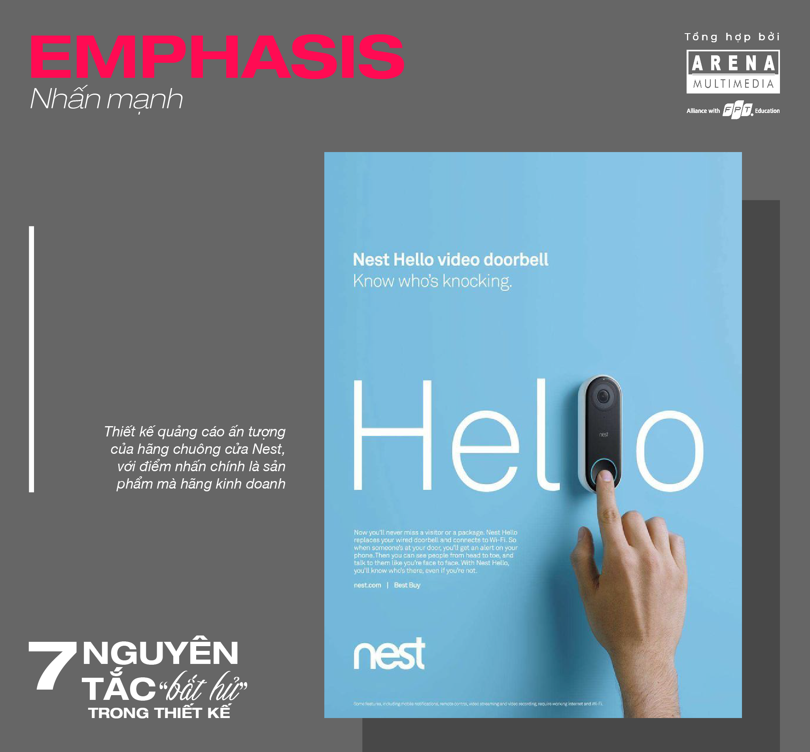
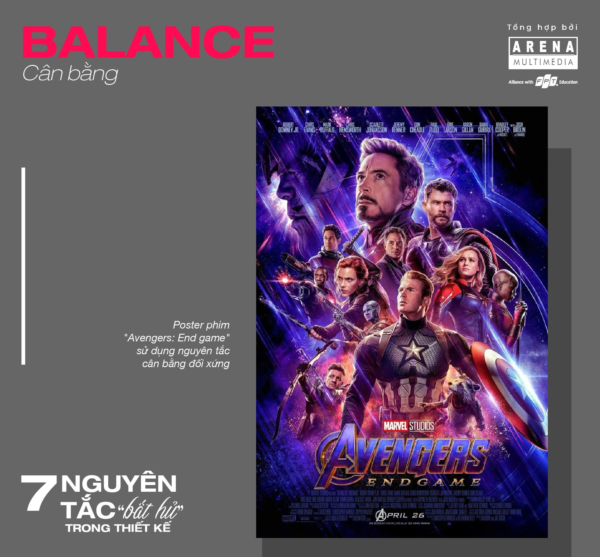
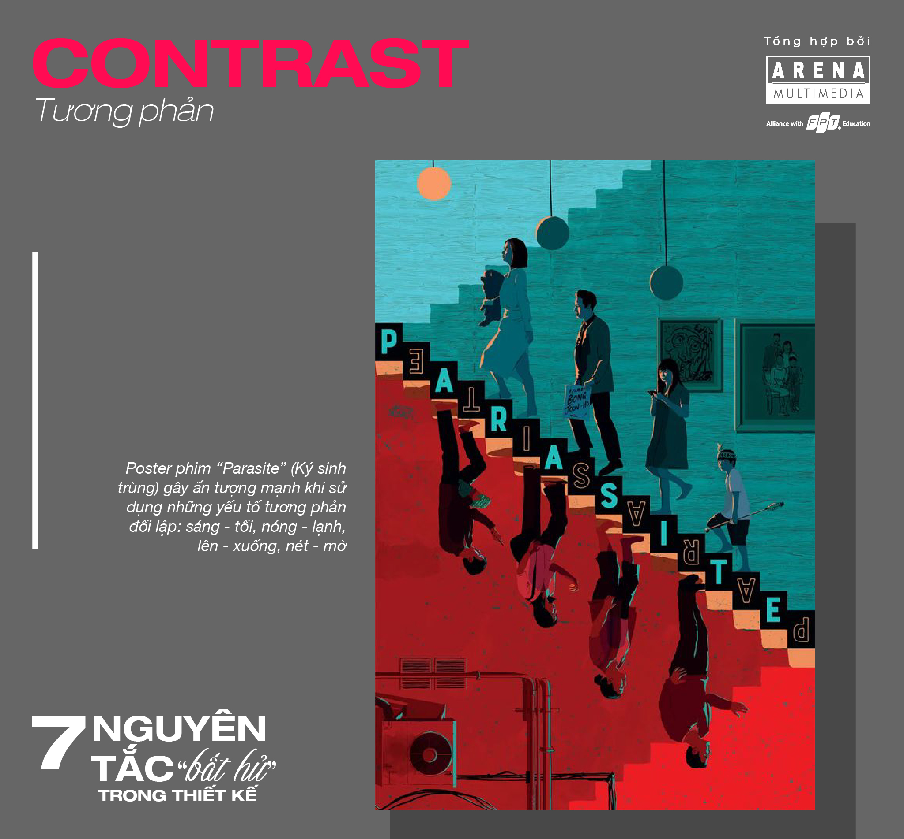
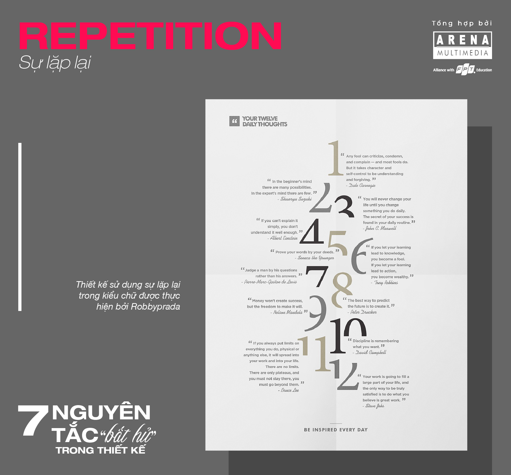
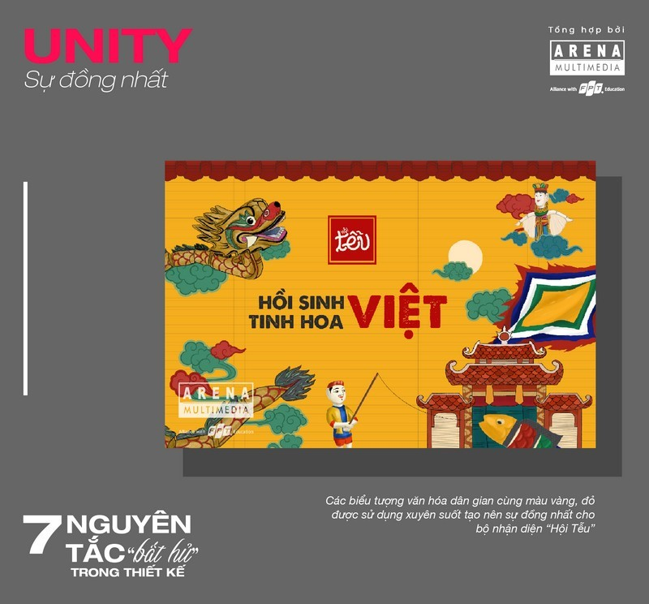
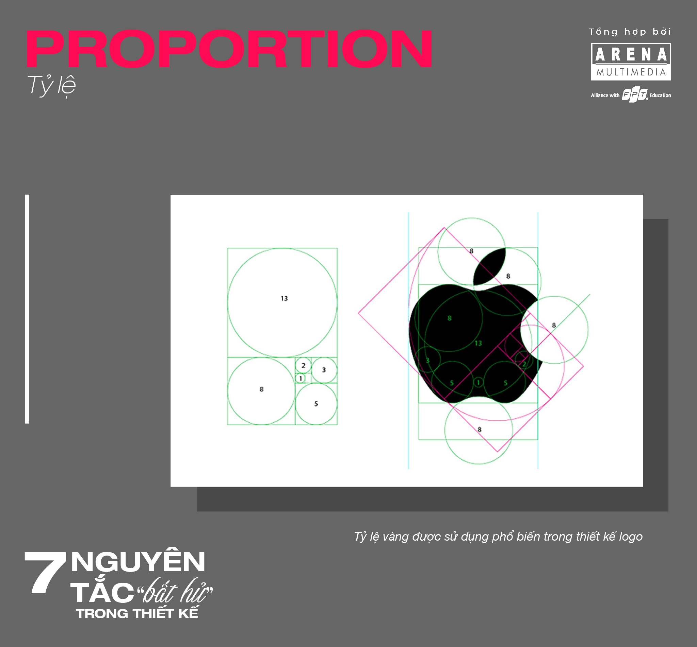
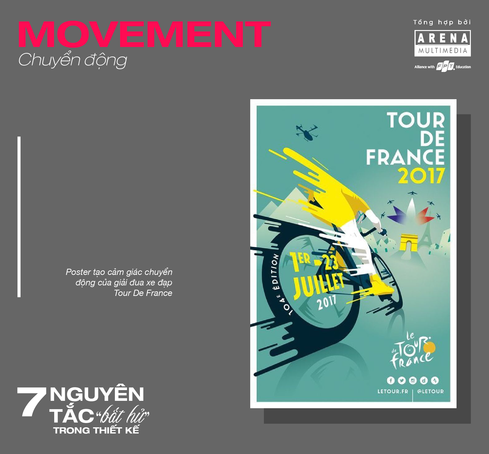

Nếu như những yếu tố cơ bản như đường nét, hình khối,… là cơ sở hình thành nên một thiết kế thì những nguyên tắc chính là “lớp keo” kết nối các yếu tố đó lại với nhau để tạo nên một tổng thể hài hòa và ấn tượng. 

Đã bao giờ khi nhìn vào một thiết kế bạn lại thắc mắc tại sao hình ảnh lại đặt ở góc này, chữ lại đặt ở góc kia chưa? Liệu chúng có tuân theo một nguyên tắc gì không hay chỉ đơn giản là Designer thích đặt chúng ở đó? Mặc dù thiết kế là công việc đòi hỏi sự sáng tạo mỗi ngày, nhưng thực tế vẫn tồn tại những nguyên tắc tiêu chuẩn nhất định. Chúng đặc biệt có ích với các nhà thiết kế mới, giúp họ có một nền móng để bắt đầu tạo nên những tác phẩm của riêng mình. 
 
## 1. Emphasis (Nhấn mạnh)
Lựa chọn điểm nhấn trong thiết kế là nguyên tắc đầu tiên khi định hình ý tưởng sáng tạo. Một thiết kế có điểm nhấn ấn tượng sẽ thu hút sự chú ý của người xem, giúp họ nắm bắt được phần nội dung quan trọng chỉ trong vài giây.
Để nhấn mạnh một đối tượng trong thiết kế, bạn có thể sử dụng sự tương phản giữa các yếu tố chính và phụ thông qua: màu sắc, kích thước, hình dạng, kết cấu, đường nét,… 

 
## 2. Balance (Cân bằng)
Cân bằng là một trong những nguyên tắc cần có và quan trọng nhất, giúp thiết kế đạt được sự hài hòa về mặt thị giác. Một thiết kế được coi là cân bằng khi các đối tượng có sự sắp xếp, phân bố đồng đều về số lượng và thường được tạo nên bởi màu sắc, kích thước, đường line, sự căn chỉnh,… 
Có 3 loại cân bằng chính: cân bằng đối xứng, cân bằng bất đối xứng và cân bằng hướng tâm.

 
## 3. Contrast (Tương phản)
Sau nguyên tắc cân bằng thì tương phản cũng là điều bạn cần chú ý trong quá trình thiết kế. Tương phản được hình thành khi sử dụng cùng lúc các yếu tố: màu sắc (nóng- lạnh), đường nét (ngang – đứng), kích thước (lớn – nhỏ), chất liệu (mịn – thô ráp), hướng chuyển động (lên – xuống),…
Nguyên tắc này thường mang lại sự ấn tượng cho thiết kế và giúp thông điệp được thể hiện mạnh mẽ hơn. Do đó, nó thường được sử dụng để nhấn mạnh tiêu đề, nội dung chính hoặc kêu gọi hành động.
 
 

## 4. Repetition (Sự lặp lại)
Repetition là sự lặp lại một cách có chủ đích các đường nét, hình khối và màu sắc trong bản thiết kế. 
Sự lặp lại hợp lý giúp truyền tải cảm xúc tốt hơn, làm cho khách hàng dễ dàng ghi nhớ thiết kế của bạn. Nguyên tắc này được áp dụng khá nhiều trong thiết kế logo, tiêu biểu như logo của các thương hiệu nổi tiếng như McDonald’s, Chanel, Starbucks,…

 
## 5. Unity (Sự đồng nhất)
Đồng nhất là nguyên tắc sử dụng những yếu tố, đối tượng, màu sắc tương tự nhau để tạo sự xuyên suốt cho thiết kế. Một số cách để tạo sự đồng nhất là: tạo sự liên tục, sắp xếp có liên kết, đặt các đối tượng gần nhau,…
Nguyên tắc này sẽ tạo sự liên kết giữa các yếu tố, giúp bản thiết kế hài hòa và mang lại cảm giác thân thiện cho người xem. Đây cũng là nguyên tắc được áp dụng phổ biến trong quá trình thiết kế bộ nhận diện thương hiệu. 

 
## 6. Proportion (Tỷ lệ)
Tỷ lệ là mối quan hệ hài hòa giữa hình dạng, kích thước, số lượng và màu sắc của hai hay nhiều yếu tố trong một bản thiết kế. Một tỷ lệ hợp lý sẽ tạo sự cân bằng cho bố cục và tăng thêm độ chuyên nghiệp cho thiết kế. 
Để tỷ lệ được chính xác và hài hòa, các Designer thường sử dụng hệ thống lưới được trang bị sẵn trong các phần mềm đồ họa để xây dựng bố cục sơ bộ cho thiết kế và điều chỉnh cách sắp xếp sao cho thật hợp lý. Trong thiết kế logo, lưới được sử dụng để phân chia tỷ lệ chính xác khi thiết kế. Còn trong thiết kế quảng cáo, lưới được dùng để xác định vị trí của text, ảnh, hình khối,… 

 
## 7. Movement (Chuyển động)
Movement là cách sử dụng các hình khối và đường nét để tạo thành đường dẫn dắt thị giác và khiến người xem có cảm giác đối tượng đang chuyển động. 3 cách tạo sự chuyển động phổ biến là: tạo hiệu ứng làm mờ, tạo đường chuyển động hoặc hiệu ứng gợn sóng. 
Ứng dụng nguyên tắc này sẽ giúp cho thiết kế sinh động, thú vị, có sức sống và tránh cảm giác “tĩnh” – đôi khi hơi buồn chán, tẻ nhạt –  thường thấy trong các thiết kế phẳng.

 
Trên đây là 7 nguyên tắc cơ bản được nhiều Designer áp dụng trong quá trình thiết kế. Để có nhiều sự sáng tạo và bứt phá hơn trong lĩnh vực sôi động này, hãy dành thời gian tìm hiểu thật kỹ các nguyên tắc và áp dụng chúng trong các tác phẩm của mình. Và biết đâu trong quá trình thực hành ấy, bạn lại tìm ra một nguyên tắc thiết kế ấn tượng của riêng mình thì sao!
