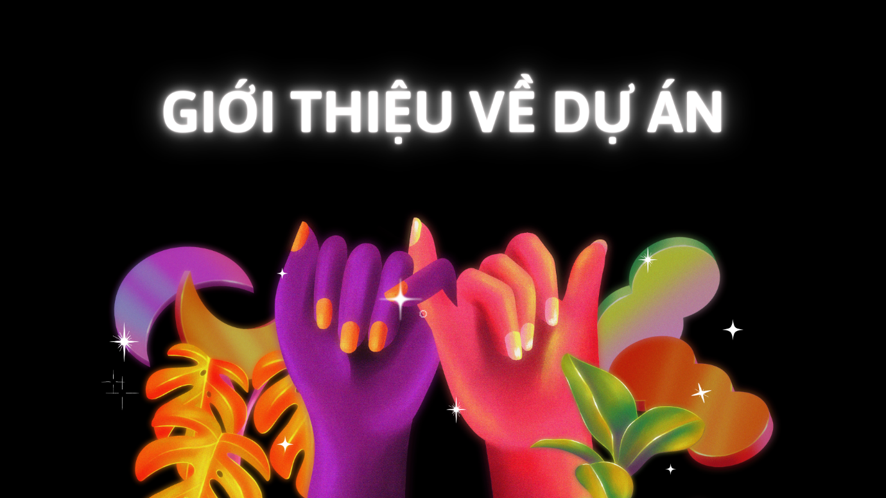

# Giới thiệu về dự án

---

## Mục đích ra đời

<!--  -->

## Ý tưởng và tên gọi

### Về ý tưởng

### Về tên gọi

## Các tính năng
::: link {/img/links/gungnir.svg} [Thay đổi giao diện]()
Bạn có thể thay đổi giao diện sang darkmode hoặc lightmode
:::

::: link {fa-pencil-alt} [Bình luận]()
Bạn có thể để lại bình luận của mình sau mỗi bài học
:::

## Công nghệ sử dụng

## Phát triển dài hạn
