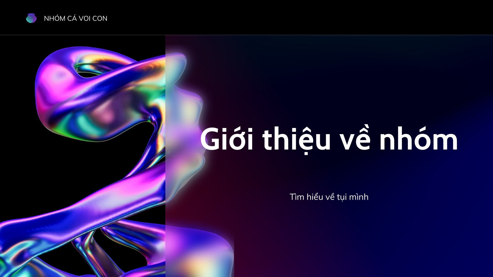

# Giới thiệu dự án

CreatiPath - Hành trình đến với sáng tạo
Đây là một dự án được thực hiện bởi các bạn sinh viên thiết kế đồ họa với mục đích tạo ra một kho kiến thức cho cộng đồng các bạn đã và đang hoặc sẽ trở thành một nhà thiết kế đồ họa có nhu cầu tìm hiểu, học hỏi thêm các thông tin về ngành đồ họa.

CreatiPath là tên trang web mà chúng mình đã thực hiện, và trong đó chúng mình sẽ tổng hợp các kiến thức về những phần mềm không thể bỏ qua của ngành đồ họa bao gồm Adobe Photoshop, Adobe Illustrator, Blender,... 

## Các thành viên

Trần Thị Mỹ Duyên

Trần Thanh Lan

Nguyễn Thị Bé Ngọc

Nguyễn Phúc Hậu

Đổ Văn An

Trần Đức Duy

## Dự định trong tương lai?

Tại CreatiPath, chúng tôi không chỉ xây dựng một trang web chia sẻ kiến thức thiết kế đồ họa mà còn đang tạo ra một cộng đồng đam mê và cống hiến cho nghệ thuật thiết kế. Trong tương lai, chúng tôi cam kết phát triển và mở rộng sứ mệnh của mình để mang lại giá trị và cơ hội cho mọi người:

Nền tảng Học tập Sâu Sắc: Chúng tôi sẽ liên tục cập nhật và mở rộng thư viện tài nguyên, bài học, và hướng dẫn về thiết kế đồ họa để cung cấp cho cộng đồng một nguồn thông tin đáng tin cậy và đa dạng.

Cộng Đồng Sôi Nổi: Chúng tôi muốn xây dựng một cộng đồng đa dạng và tích cực, nơi mọi người có thể chia sẻ ý tưởng, kinh nghiệm và hỗ trợ lẫn nhau trong quá trình học và phát triển.

Sự Nghiệp và Sự Phát Triển Cá Nhân: CreatiPath sẽ cung cấp các khóa học và tài nguyên không chỉ giúp người dùng nâng cao kỹ năng thiết kế của họ mà còn hỗ trợ họ trong việc xây dựng sự nghiệp và phát triển cá nhân.

Sự Sáng Tạo và Khám Phá: Chúng tôi sẽ khuyến khích sự sáng tạo và khám phá trong thiết kế đồ họa bằng cách cung cấp các dự án thú vị, thử thách và cơ hội hợp tác.

Công Nghệ và Tiên Tiến: CreatiPath sẽ tiếp tục theo đuổi sự tiên tiến trong công nghệ và phương pháp thiết kế mới nhằm đáp ứng nhu cầu ngày càng đa dạng của cộng đồng thiết kế.

Với những cam kết này, chúng tôi hy vọng CreatiPath sẽ không chỉ là một trang web chia sẻ kiến thức mà còn là một điểm đến đầy cảm hứng và thú vị cho mọi người đam mê thiết kế đồ họa.

## Liên hệ với chúng tôi như thế nào?
 
::: link {fa-github-alt} [0799583258]()
Liên hệ với tụi mình qua số này!
::: 

::: link {fa-linkedin-in} [CreatiPath]()
Trang Facebook của tụi mình
::: 

::: link {fa-envelope} [creatipath@gmail.com]()
Gmail của tụi mình
:::

